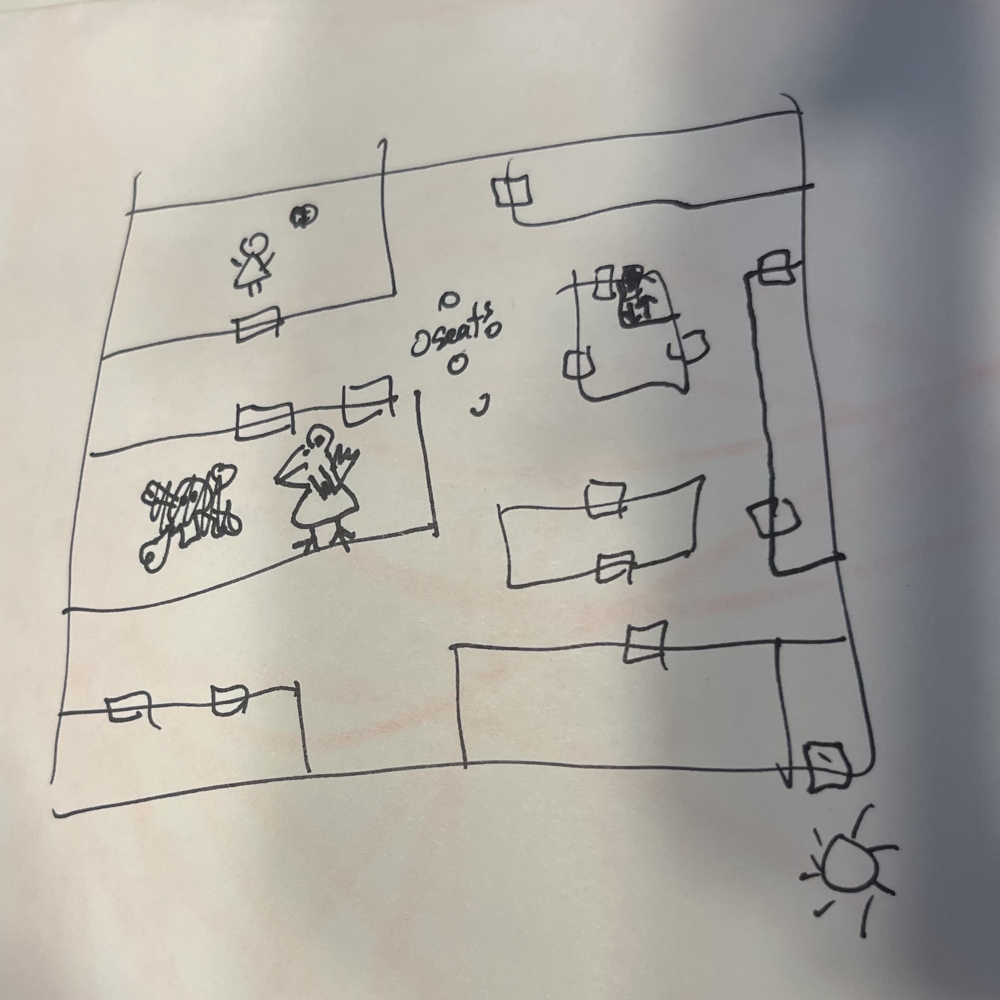

<!-- markdownlint-disable MD041 -->
<!----------------------------------------------------------------------
DISABLE MARKDOWN ERRORS
------------------------------------------------------------------------

MD033 no-inline-html: Inline HTML
MD041 first-line-h1: First line in a file should be a top-level heading
MD045/no-alt-text: Images should have alternate text (alt text)markdownlintMD045
MD060 table-column-style: Table column style [Table pipe does not align with header for style "aligned"]

FORMAT
<!-- markdownlint-disable MD0XX -->

<!--------------------------------------------------------------------->

<!-- markdownlint-disable MD033 -->
<!-- markdownlint-disable MD045 -->

<link rel="stylesheet" href="css/flux-bunny-text-md.css">

# Notes for Gears and Glimmer

This document includes game play notes from DnD sessions.

## House Rules

I can cast ritual cast Speak with Animals.

## Navigation

| Suit         | Value            | Challenge    | Solved? | Notes                                       |
| ------------ | ---------------- | ------------ | ------- | ------------------------------------------- |
| Hermit       | Minotaur         | Y            |         |                                             |
| Lovers       |                  | Y            |         |                                             |
| Major Arcana | Empress          | Fairy Palace | N       |                                             |
| Hierophant   | Temple of Salune | N            |         |                                             |
| Major Arcana | The Lovers       |              |         |                                             |
| Major Arcana | The Hermit       |              |         |                                             |
| Major Arcana | The World        | Tree Tower   | Y       | Rogl tossed empty wine bottle, killed trees |
| Intelligence | 1                |              |         |                                             |
| Intelligence | 5                |              |         |                                             |
| Intelligence | 10               |              |         |                                             |
| Intelligence | Knight (12)      |              |         |                                             |
| Wisdom       | 1                |              |         |                                             |
|              |                  | Tea pot fix  | Y       |                                             |

## 2026-09-20 Sun

- Time reset
- Daisy confused, remembers everything but feels like a dream
- Meet up with Fnip, Rogl, Baldus
- Try to save Brambleshade
- Go to court
- Court is in the castle
- Rogl tries to pick the lock of a backdoor
- We go in through the window
- Peak through double doors - banquet style room
- 100 chairs on each side
- No bunny present
- Food and drinks served
- Ask a servant directions to court
- See Brambleshade in court, Rogl eavesdrops
- Brambleshade talking with Corvid (cro bro) and 2 humans
- Brambleshade is concerned, humans trying to reassure him that things look bad but will be ok
- As Corvid and Brambleshade go in different direct directions, Rogl casts sleep on Corvid

Court Drawing

- Corvid ends up in bag of holding
- Fnip gives me sending stone to communicate
- Brambleshade walking into embassy

| Lvl | Allotment | Used |
| --- | --------- | ---- |
| 1   | 4         |      |
| 2   | 3         |      |
| 3   | 3         |      |
| 4   | 1         |      |
